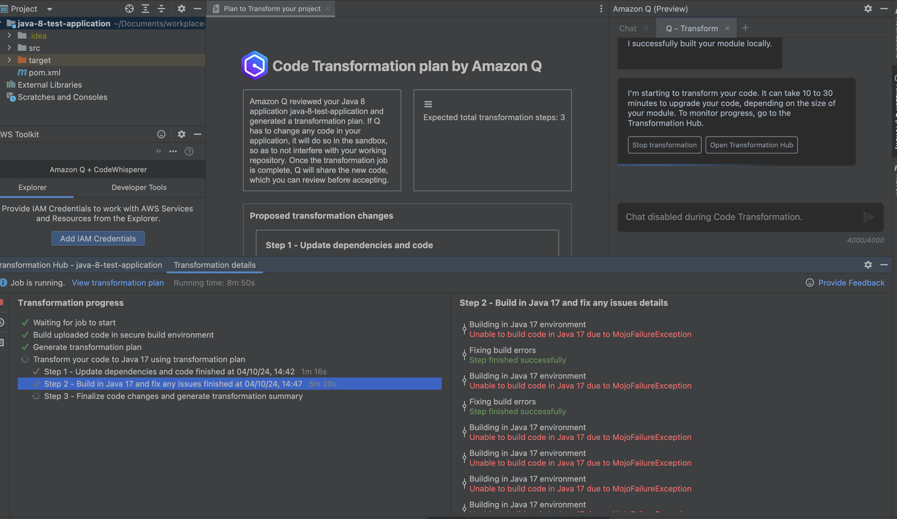
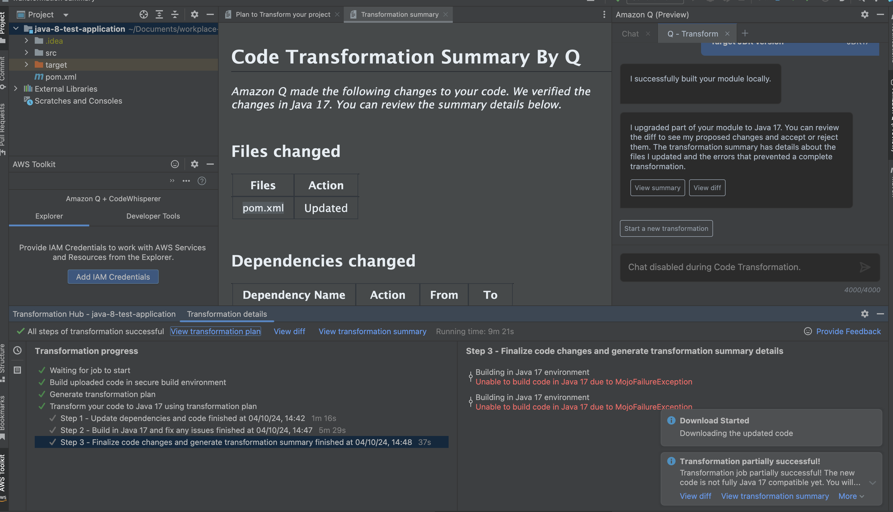
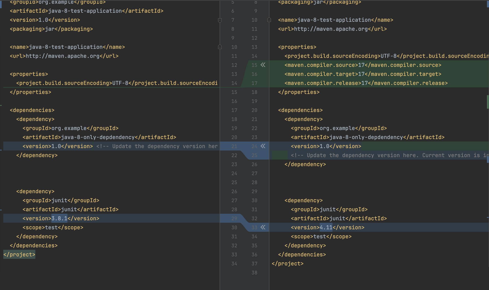

# hil-test-repository

The repository is to help initiate a partial transformation of a Java application due to a first party (1p) dependency.

## Pre-requisites

1. You need Java 8 installed
2. You need your local terminal `JAVA_HOME` path to be set to Java 8. You can verify with `java -version`
3. You need [maven](https://maven.apache.org/) >3.95
4. You need AWS Toolkit and IDE installed
- [VSCode](https://aws.amazon.com/visualstudiocode/)
- [IntelliJ](https://docs.aws.amazon.com/toolkit-for-jetbrains/latest/userguide/welcome.html)

#### [java-8-test-1p-dependency](./java-8-test-1p-dependency/)

This is the main 1p dependency definition.

1. `cd java-8-test-1p-dependency`
2. run `mvn clean install` to set up this package

#### [java-17-only-dependency](./java-17-only-dependency/)

This will output the version upgrades for java-8-test-1p-dependency and will mimic your local maven central accessible to ONLY your machine

1. run `mvn clean install` to 

#### [java-8-test-application](./java-8-test-application/)

This is the main application and you should run `mvn clean install` after the last two directories

## Usage

When submitting this repository for a transformation upgrade using [Amazon Q Transform](https://docs.aws.amazon.com/amazonq/latest/qdeveloper-ug/code-transformation.html), you should not need to compile or do anything. You should:

1. Open [java-8-test-1p-dependency](./java-8-test-1p-dependency/) directory and install the 1p-dependency `cd java-8-1p-dependency` and run `mvn clean install` to compile the module
2. Open [java-17-only-dependency](./java-17-only-dependency/) and run `mvn clean install`
3. Open the IDE in the [java-8-test-application](./java-8-test-application/) and the root folder should be "application". Once again run `mvn clean install`
3. Open the Amazon Q chat panel and submit a job for this root pom.xml module with the `/transform` command in the chat

### IntelliJ

To use in Jetbrains IntelliJ to run a transformation, its simple:
1. Open the workspace root under [java-8-test-application](./java-8-test-application/)
2. Open Q Chat and run the `/transform` command
3. There is only one module and one upgrade path to Java version 17 so select that
4. Once transformation is started see the "expected output" section below 👍

#### Expected Output

**Expected build progress output**

**Expected final build output**

**Expected pom diff output**

### VSCode

To use in VSCode, its requires more setup.

#### Pre-requisites
1. Java 8 installed on your machine
2. Maven installed on your machine

#### Expected Output
